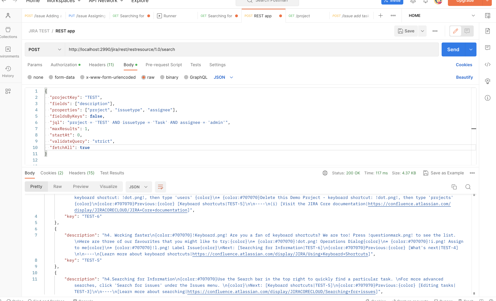

# Dynamic REST
Dynamic REST. Rest accept a JQL string, and return set of fields. REST perform a JQL search and return JSON with the selected fields. The result (issues) output without limitation on the number of displays.

#### Before you begin. 
Install the [Atlassian Plugin SDK](https://developer.atlassian.com/server/framework/atlassian-sdk/), you'll also need the following:  
Java SE Development Kit (JDK) 8 or AdoptOpenJDK 8  
Your JAVA_HOME variable set  

#### Before first run  
JIRA plugin use maven installing inside pligin package so you need to change path to your Maven directory in your IDE  

Path to Maven in MacOS
usr/local/Cellar/atlassian-plugin-sdk/8.2.7/libexec/apache-maven-3.5.4  

`atlas-run`

#### Searching for issues using POST  
If your JQL query is too large to specify in a URL parameter, you can POST your JQL query (in JSON format)  
to the Jira REST API search resource instead. Any additional URL parameters (apart from the url parameter)  
described above must be included in your JSON-formatted JQL query. 
 
#### Endpoint 
http://localhost:2990/jira/rest/restresource/1.0/search  
 
#### Request  
{ 
"projectKey": "TEST", 
"fields": ["description"], 
"properties": ["project", "issuetype", "assignee"], 
"fieldsByKeys": false, 
"jql": "project = 'TEST' AND issuetype = 'Task' AND assignee = 'admin'", 
"maxResults": 1, 
"startAt": 0, 
"validateQuery": "strict", 
##### "fetchAll": false //this switcher to output without limitation on the number of displays. 
} 
 
#### Response 
{ 
"maxResults": 1, 
"startAt": 0, 
"total": 6, 
"expand": "schema,names", 
"issues": [ 
{ 
"key": "TEST-6", 
"description": "h4. Now it's your turn!\n{color:#707070}Now, it is your turn to create your first task. Click the  
'Create' button and get your project started. {color}\nh4. If you are a JIRA Core administrator, you can create  
....} 

#### Response if switcher fetchAll turn on:

Full documentation is always available at:

https://developer.atlassian.com/display/DOCS/Introduction+to+the+Atlassian+Plugin+SDK

